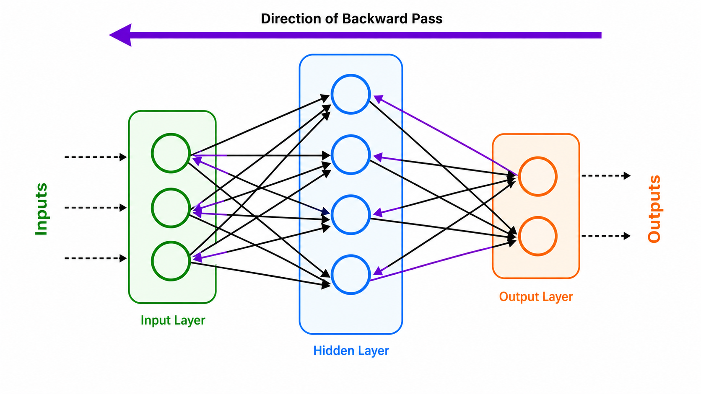
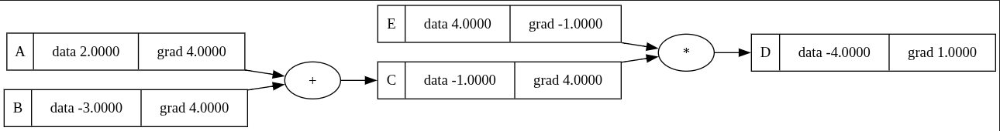
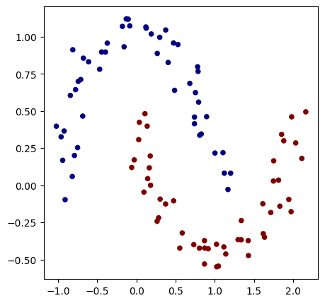
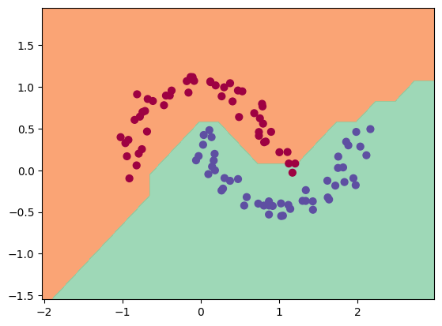

# Auto-grad-implementation

## 1. What is AutoGrad, and how is it used with an MLP?

**AutoGrad (Automatic Differentiation)** is a computational technique used to automatically evaluate the derivatives of mathematical functions. Instead of manually deriving the calculus for complex neural networks, AutoGrad dynamically builds a computational graph as operations are performed on scalars or tensors. It applies the chain rule of calculus in a backward pass to calculate the gradients of the output with respect to all input variables.

**How it is used with a Multi-Layer Perceptron (MLP):**
When training an MLP, the goal is to minimize a loss function. AutoGrad powers the **backpropagation** step. During the forward pass, data flows through the network layers to produce predictions, and AutoGrad records every mathematical operation (additions, multiplications, activations). Once the loss is calculated, AutoGrad traverses the graph backward to compute the gradient of the loss with respect to every weight and bias in the network. Optimizers, like Stochastic Gradient Descent (SGD), then use these gradients to iteratively update the parameters and improve the network's accuracy.



---

## 2. Prerequisites

To run the `AutogradModule` and `MLP`:
- **Python Version:** You must use **Python 3.12**.

---
## 3. Core Components Explained

The AutoGrad engine is built on two primary concepts: the fundamental `Value` object, and the higher-level `MLP` (Multi-Layer Perceptron) object. 

### What is `Value`?
At the heart of the engine is the `Value` object. A `Value` is essentially a wrapper around a single floating-point number (a scalar). Every time you perform a mathematical operation (like addition or multiplication) on a `Value`, the engine records that operation and builds a mathematical "graph." 

When you call `.backward()` on the final output, the engine traverses this graph in reverse, automatically applying the chain rule to calculate the gradient (the rate of change) for every single variable that contributed to the output.

**Simple `Value` Example:**
```python
from Engine import CppModule as module
from Utils.Draw_nn import draw_dot

# 1. Create independent variables
a = module.Value(2.0)
b = module.Value(-3.0)

# 2. Perform math operations (this builds the graph)
c = a + b                     # c = -1.0
d = c * module.Value(4.0)     # d = -4.0

# 3. Trigger automatic differentiation
d.backward()

# 4. Inspect the values and their gradients
draw_dot(d)
```

---

### What is `MLP`?
The `MLP` is a helper class that structures hundreds or thousands of `Value` objects into organized neural network layers. Instead of manually multiplying weights and adding biases, you define the network's architecture, and the `MLP` handles the underlying matrix operations and activation functions.

Because the `MLP` is constructed entirely out of `Value` objects, the entire network inherently knows how to compute its own gradients.

**Simple `MLP` Example:**
```python
from Engine import CppModule as module
from Utils.Draw_nn import draw_dot

# 1. Initialize a small Multi-Layer Perceptron
model = module.MLP()

# Add a Hidden Layer (3 inputs -> 4 outputs) with ReLU activation
model.Linear(3, 4)
model.Relu() #Or model.Tanh()

# Add an Output Layer (4 inputs -> 1 output)
model.Linear(4, 1)

# 2. Define a single data point and target
x_input = [2.0, 3.0, -1.0]
y_true = 1.0

for i in range(5):
    # 3. Forward Pass: Get the model's prediction
    prediction = model(x_input)

    # 4. Calculate Loss (Mean Squared Error)
    loss = (prediction - y_true) * (prediction - y_true)

    
    # 5. Backward Pass: Calculate gradients for all model parameters
    model.zero_grad() # Always clear old gradients first!
    loss.backward()

    # 6. Update weights with lr = 0.01
    mlp.step(lr = 0.01)

    print(f"Loss: {loss}")
```
---

## 4. Example: The Classification Task Notebook

The provided notebook (`Classification_Task.ipynb`) demonstrates the power of the custom AutoGrad engine by solving a non-linear binary classification problem.

### The Task
The objective is to classify 2D synthetic data points belonging to two intertwining half-circles. The dataset is generated using `sklearn.datasets.make_moons` with **100 samples** and a noise variance of **0.1**. The target labels are scaled from $\{0, 1\}$ to $\{-1, 1\}$ to support a Support Vector Machine (SVM) style loss function.



### Network Architecture
The model is a standard Multi-Layer Perceptron utilizing our custom `module.MLP()`. It features two hidden layers with ReLU activations and a linear output layer, totaling **337 parameters**.

| Layer | Type | Input Dimension | Output Dimension | Activation |
| :--- | :--- | :--- | :--- | :--- |
| **0** | Hidden | 2 | 16 | ReLU |
| **1** | Hidden | 16 | 16 | ReLU |
| **2** | Output | 16 | 1 | Linear |

### Loss Function & Optimization
The network optimizes a combined **SVM Max-Margin Loss** and **L2 Regularization**. 

The loss for a batch size of $N$ is defined mathematically as:
$$L = \frac{1}{N} \sum_{i=1}^{N} \max(0, 1 - y_i \cdot \hat{y}_i) + \alpha \sum p^2$$
Where $y_i$ is the true label ($-1$ or $1$), $\hat{y}_i$ is the predicted raw score, $p$ represents the model parameters, and $\alpha = 10^{-4}$ is the regularization strength.

The model is optimized using **Stochastic Gradient Descent (SGD)**, executing a custom training loop where the learning rate decays linearly from **1.0** to **0.1** over **100 steps**.

### Results
After Doing just 40 iterations on the whole data got accuracy ~= 98%



---
## Adding a C++ Module to Python

To harness the performance of C++ within our Python environment, we use a custom C++ extension module. This process involves writing the C++ logic, exposing it to Python, and using CMake to compile it into an importable library. 

Here is the step-by-step breakdown of how the whole process works:

### 1. Writing the C++ Logic (`module.cpp`)
The `module.cpp` file contains the core C++ code we want to execute, alongside the binding code that tells Python how to interact with it. We use **pybind11** to create a seamless bridge between the two languages. 

Here is a simplified example of what `module.cpp` looks like. It defines a basic C++ function and then uses the `PYBIND11_MODULE` macro to expose it to Python:

```cpp
#include <pybind11/pybind11.h>

namespace py = pybind11;

// 1. The native C++ function
int add(int i, int j) {
    return i + j;
}

// 2. The Binding code
PYBIND11_MODULE(my_cpp_module, m) {
    m.doc() = "Pybind11 example module"; // Optional module docstring
    m.def("add", &add, "A function that adds two numbers");
}
```

### 2. Configuring the Build System (`CMakeLists.txt`)
Python cannot run raw `.cpp` files. The C++ code must be compiled into a shared library (a `.so` file on Linux/macOS or a `.pyd` file on Windows). We use `CMakeLists.txt` to define the build rules, find the required Python development headers, and link the pybind11 library.

A standard `CMakeLists.txt` for this process looks like this:

```cmake
cmake_minimum_required(VERSION 3.12)
project(MyCppModule)

# Find the pybind11 library
find_package(pybind11 REQUIRED)

# Create the Python module
pybind11_add_module(my_cpp_module module.cpp)
```

### 3. Compiling and Running
Once the `module.cpp` and `CMakeLists.txt` are set up, CMake compiles the project. The output is a binary file named something like `my_cpp_module.cpython-39-x86_64-linux-gnu.so`. 

Then you can simply import it and run the C++ code exactly as if it were native Python code:

```python
import my_cpp_module
# This is executing the compiled C++ code!
result = my_cpp_module.add(5, 7)
print(result) # Outputs: 12
```
